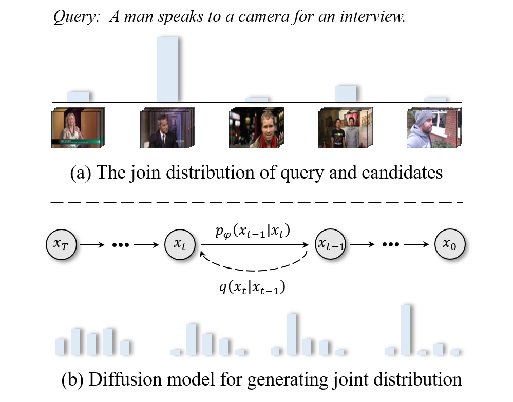

<div align="center">
  
# 【ICCV'2023 🔥】DiffusionRet: Generative Text-Video Retrieval with Diffusion Model
[](https://iccv2023.thecvf.com/)
[](https://arxiv.org/abs/2303.09867)
</div>

The implementation of the paper [DiffusionRet: Generative Text-Video Retrieval with Diffusion Model](https://arxiv.org/abs/2303.09867).

In this paper, we propose a novel diffusion-based text-video retrieval framework, called DiffusionRet, which addresses the limitations of current discriminative solutions
from a generative perspective.

## 📌 Citation
If you find this paper useful, please consider staring 🌟 this repo and citing 📑 our paper:
```
@inproceedings{jin2023diffusionret,
  title={DiffusionRet: Generative Text-Video Retrieval with Diffusion Model},
  author={Jin, Peng and Li, Hao and Cheng, Zesen and Li, Kehan and Ji, Xiangyang and Liu, Chang and Yuan, Li and Chen, Jie},
  booktitle={ICCV},
  pages={2470-2481},
  year={2023}
}
```

<details open><summary>💡 I also have other text-video retrieval projects that may interest you ✨. </summary><p>

> [**Video-Text as Game Players: Hierarchical Banzhaf Interaction for Cross-Modal Representation Learning**](https://arxiv.org/abs/2303.14369)<br>
> Accepted by CVPR 2023 (Highlight) | [[HBI Code]](https://github.com/jpthu17/HBI)<br>
> Peng Jin, Jinfa Huang, Pengfei Xiong, Shangxuan Tian, Chang Liu, Xiangyang Ji, Li Yuan, Jie Chen

> [**Expectation-Maximization Contrastive Learning for Compact Video-and-Language Representations**](https://arxiv.org/abs/2211.11427)<br>
> Accepted by NeurIPS 2022 | [[EMCL Code]](https://github.com/jpthu17/EMCL)<br>
> Peng Jin, Jinfa Huang, Fenglin Liu, Xian Wu, Shen Ge, Guoli Song, David Clifton, Jie Chen

> [**Text-Video Retrieval with Disentangled Conceptualization and Set-to-Set Alignment**](https://arxiv.org/abs/2305.12218)<br>
> Accepted by IJCAI 2023 | [[DiCoSA Code]](https://github.com/jpthu17/DiCoSA)<br>
> Peng Jin, Hao Li, Zesen Cheng, Jinfa Huang, Zhennan Wang, Li Yuan, Chang Liu, Jie Chen
</p></details>

## 📣 Updates
* **[2023/08/27]**: We release the training code.
* **[2023/07/14]**: Our **DiffusionRet** has been accepted by ICCV 2023! We will release the training code asap. 
* **[2023/06/28]**: We release the inference code.
* **[2023/03/31]**: Our paper is under review. After our paper is published, we will release the code as soon as possible.

## 📕 Overview
Existing text-video retrieval solutions are, in essence, discriminant models focused on maximizing the conditional likelihood, i.e., p(candidates|query). While straightforward, this de facto paradigm overlooks the underlying data distribution p(query), which makes it challenging to identify out-of-distribution data. To address this limitation, we creatively tackle this task from a generative viewpoint and model the correlation between the text and the video as their joint probability p(candidates,query). This is accomplished through a diffusion-based text-video retrieval framework (DiffusionRet), which models the retrieval task as a process of gradually generating joint distribution from noise.

<div align="center">

</div>

## 🚀 Quick Start
### Setup

#### Setup code environment
```shell
conda create -n DiffusionRet python=3.9
conda activate DiffusionRet
pip install -r requirements.txt
pip install torch==1.8.1+cu102 torchvision==0.9.1+cu102 -f https://download.pytorch.org/whl/torch_stable.html
```

#### Download CLIP Model
```shell
cd DiffusionRet/models
wget https://openaipublic.azureedge.net/clip/models/40d365715913c9da98579312b702a82c18be219cc2a73407c4526f58eba950af/ViT-B-32.pt
# wget https://openaipublic.azureedge.net/clip/models/5806e77cd80f8b59890b7e101eabd078d9fb84e6937f9e85e4ecb61988df416f/ViT-B-16.pt
# wget https://openaipublic.azureedge.net/clip/models/b8cca3fd41ae0c99ba7e8951adf17d267cdb84cd88be6f7c2e0eca1737a03836/ViT-L-14.pt
```

#### Download Datasets
<div align=center>

|Datasets|Google Cloud|Baidu Yun|Peking University Yun|
|:--------:|:--------------:|:-----------:|:-----------:|
| MSR-VTT | [Download](https://drive.google.com/drive/folders/1LYVUCPRxpKMRjCSfB_Gz-ugQa88FqDu_?usp=sharing) | [Download](https://pan.baidu.com/s/1Gdf6ivybZkpua5z1HsCWRA?pwd=enav) | [Download](https://disk.pku.edu.cn/link/AA6A028EE7EF5C48A788118B82D6ABE0C5) |
| MSVD | [Download](https://drive.google.com/drive/folders/18EXLWvCCQMRBd7-n6uznBUHdP4uC6Q15?usp=sharing) | [Download](https://pan.baidu.com/s/1hApFdxgV3TV2TCcnM_yBiA?pwd=kbfi) | [Download](https://disk.pku.edu.cn/link/AA6BD6FC1A490F4D0E9C384EF347F0D07F) |
| ActivityNet | TODO | [Download](https://pan.baidu.com/s/1tI441VGvN3In7pcvss0grg?pwd=2ddy) | [Download](https://disk.pku.edu.cn/link/AAE744E6488E2049BD9412738E14AAA8EA) |
| DiDeMo | TODO | [Download](https://pan.baidu.com/s/1Tsy9nb1hWzeXaZ4xr7qoTg?pwd=c842) | [Download](https://disk.pku.edu.cn/link/AA14E48D1333114022B736291D60350FA5) |

</div>

### Model Zoo
<div align=center>

|Checkpoint|Google Cloud|Baidu Yun|Peking University Yun|
|:--------:|:--------------:|:-----------:|:-----------:|
| MSR-VTT | [Download](https://drive.google.com/file/d/16eTeXS9EZnBWP8EcO00Jxi6ZwsIUUHW_/view?usp=sharing) | [Download](https://pan.baidu.com/s/1JVxwh5SxnE0rGcAe9dCP_g?pwd=3xzi) | [Download](https://disk.pku.edu.cn:443/link/989708CFB90C80B93F7297A5260F5582) |
| ActivityNet | [Download](https://drive.google.com/file/d/1KcajRwDJMNxSWrlgLGHJ4nFtwgv0UWdc/view?usp=drive_link) | [Download](https://pan.baidu.com/s/1Nn-jUCJcydXhB01CNRvsfg?pwd=qsbd) | [Download](https://disk.pku.edu.cn:443/link/0E4384D13EA6E1693EF400FC27053033) |

</div>

### Evaluate
#### Eval on MSR-VTT
```shell
CUDA_VISIBLE_DEVICES=0 \
python -m torch.distributed.launch \
--master_port 2502 \
--nproc_per_node=1 \
eval.py \
--workers 8 \
--batch_size_val 128 \
--anno_path data/MSR-VTT/anns \
--video_path ${DATA_PATH}/MSRVTT_Videos \
--datatype msrvtt \
--max_words 32 \
--max_frames 12 \
--video_framerate 1 \
--diffusion_steps 50 \
--noise_schedule cosine \
--init_model ${CHECKPOINT_PATH} \
--output_dir ${OUTPUT_PATH}
```

#### Eval on ActivityNet Captions
```shell
CUDA_VISIBLE_DEVICES=0,1 \
python -m torch.distributed.launch \
--master_port 2502 \
--nproc_per_node=2 \
eval.py \
--workers 8 \
--batch_size_val 128 \
--anno_path ${DATA_PATH}/ActivityNet \
--video_path ${DATA_PATH}/ActivityNet/Activity_Videos \
--datatype activity \
--max_words 64 \
--max_frames 64 \
--video_framerate 1 \
--diffusion_steps 50 \
--noise_schedule cosine \
--init_model ${CHECKPOINT_PATH} \
--output_dir ${OUTPUT_PATH}
```

### Train
#### Discrimination Pretrain 
Train the feature extractor from the discrimination perspective.

```shell
CUDA_VISIBLE_DEVICES=0,1,2,3 \
python -m torch.distributed.launch \
--master_port 2502 \
--nproc_per_node=4 \
main_retrieval.py \
--do_train 1 \
--workers 8 \
--n_display 50 \
--epochs 5 \
--lr 1e-4 \
--coef_lr 1e-3 \
--batch_size 128 \
--batch_size_val 128 \
--anno_path data/MSR-VTT/anns \
--video_path ${DATA_PATH}/MSRVTT_Videos \
--datatype msrvtt \
--max_words 32 \
--max_frames 12 \
--video_framerate 1 \
--stage discrimination \
--output_dir ${OUTPUT_PATH}
```

#### Generation Finetune
Optimize the generator from the generation perspective.

```shell
CUDA_VISIBLE_DEVICES=0,1,2,3 \
python -m torch.distributed.launch \
--master_port 2502 \
--nproc_per_node=4 \
main_retrieval.py \
--do_train 1 \
--workers 8 \
--n_display 50 \
--epochs 5 \
--lr 1e-4 \
--coef_lr 1e-3 \
--batch_size 128 \
--batch_size_val 128 \
--anno_path data/MSR-VTT/anns \
--video_path ${DATA_PATH}/MSRVTT_Videos \
--datatype msrvtt \
--max_words 32 \
--max_frames 12 \
--video_framerate 1 \
--stage generation \
--diffusion_steps 50 \
--noise_schedule cosine \
--init_model ${CHECKPOINT_PATH} \
--output_dir ${OUTPUT_PATH}
```


## 🎗️ Acknowledgments
Our code is based on [EMCL](https://github.com/jpthu17/EMCL), [CLIP](https://github.com/openai/CLIP), [CLIP4Clip](https://github.com/ArrowLuo/CLIP4Clip/) and [DRL](https://github.com/foolwood/DRL). We sincerely appreciate for their contributions.

